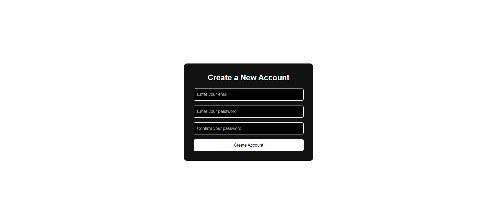
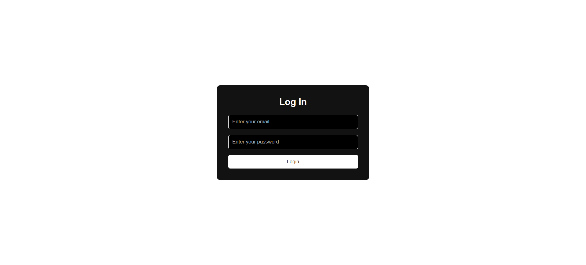
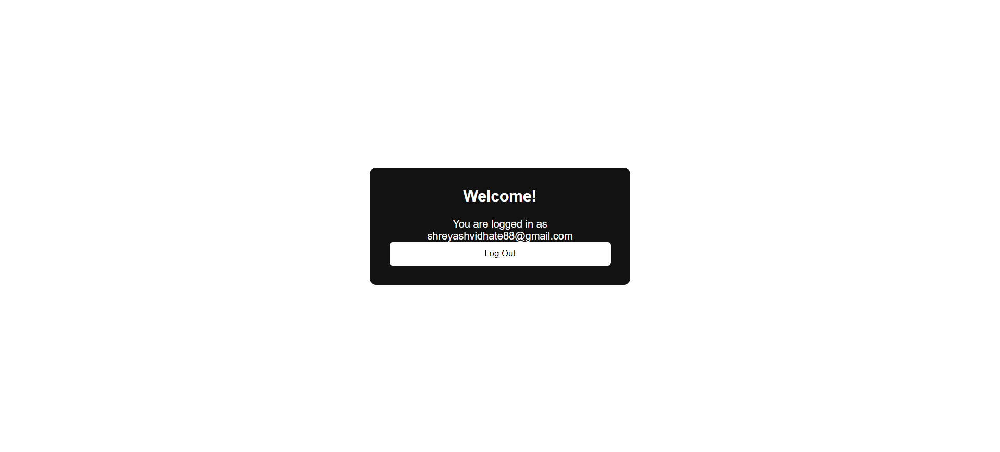
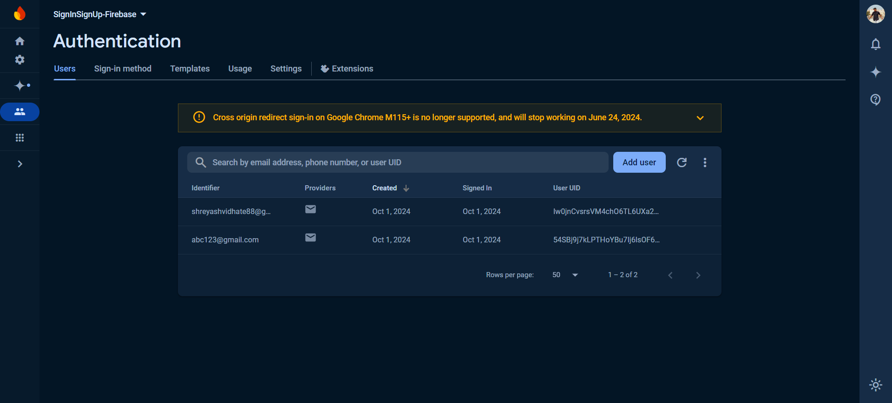

# React + Firebase Authentication Page

This project is a **Sign In/Sign Up** page built with **React** and **Firebase Authentication**. It allows users to create accounts, sign in, and sign out using Firebase's powerful authentication services. This project reflects my ongoing journey of mastering web development by experimenting with various tools, including Firebase while learning the MERN stack.

## 🚀 Features

- User Registration with Email and Password
- User Login with Email and Password
- Firebase Authentication
- Password reset functionality
- Responsive design suitable for all devices

## 🛠️ Technologies Used

- **Frontend**: React, React Router DOM
- **Authentication**: Firebase Authentication
- **Dev Tools**: Vite, ESLint

## 📸 Screenshots

### Sign Up Page

### Sign In Page

### Database

